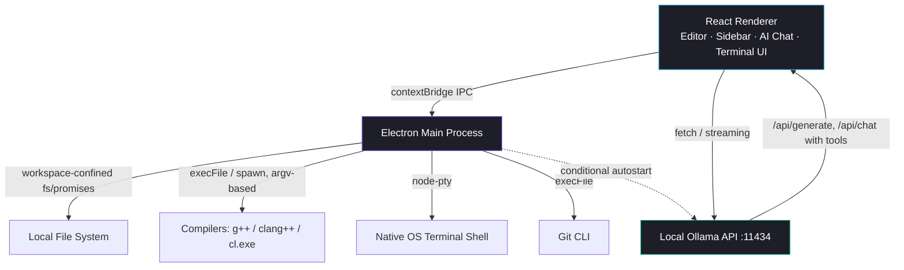

<div align="center">

  

  # Onyx Code

  **A privacy-first, offline desktop IDE built with Electron, React, TypeScript, and a local Ollama-backed AI assistant.**

  [](https://opensource.org/licenses/MIT)
  [](https://www.electronjs.org/)
  [](https://reactjs.org/)
  [](https://ollama.com/)

  *Onyx Code is a VS Code-style desktop IDE with first-class C++/competitive-programming tooling and a fully local AI coding assistant - no cloud APIs, no telemetry, no subscription.*

</div>

---

## 📖 Table of Contents
1. [✨ Key Features](#-key-features)
2. [🏗️ Architecture Overview](#️-architecture-overview)
3. [🛠️ Workspace & IDE Capabilities](#️-workspace--ide-capabilities)
4. [🤖 AI Workflows & Assistant Modes](#-ai-workflows--assistant-modes)
5. [🔒 Security Model](#-security-model)
6. [🖥️ Technical Stack](#️-technical-stack)
7. [🚀 Getting Started](#-getting-started)

---

## ✨ Key Features

- **🔒 100% Private & Offline:** Runs entirely on your machine via [Ollama](https://ollama.com/). No remote APIs, no telemetry, no subscription fees.
- **💻 VS Code-Style IDE:** Monaco editor, file explorer, integrated terminal (`node-pty`), Source Control panel, Problems panel, and a Run & Debug view - all in a familiar layout.
- **⚡ C++-First Tooling:** One-click starter templates (Hello World, competitive-programming fast I/O, OOP, BST/DSA, C++20 ranges), automatic compiler detection (GCC/Clang/MSVC), and inline build diagnostics parsed straight from the compiler.
- **🤖 Local AI Chat + Autonomous Agent Mode:** Chat with a local model for explanations and code, or hand it tool-calling access to read/search/edit files and run commands in your workspace - fully rendered Markdown output with syntax-highlighted, applicable code blocks.
- **🧩 Extensions View & Model Manager:** Browse and pull recommended coding models (Qwen 2.5 Coder, Gemma 3, Llama 3.1, DeepSeek Coder) with one click, and manage your Ollama connection (including remote/LAN hosts) from inside the app.
- **🛡️ Workspace-Confined by Design:** File operations - including everything the AI agent can touch - are restricted to the folder you actually opened.

---

## 🏗️ Architecture Overview

Onyx Code splits its work across Electron's two process types, connected by a narrow, explicit IPC surface (`contextBridge`, `contextIsolation: true`, `nodeIntegration: false`):



- **Renderer (React + TypeScript):** Owns editor/tab state, the file tree, AI chat state, settings, and the run-output/problems/terminal bottom panel. Talks to Ollama directly over `fetch` (no main-process proxying needed since it's just HTTP to localhost).
- **Main Process (Electron):** Every filesystem IPC handler (`read-file`, `write-file`, `delete-file`, `edit-file`, `read-directory`, run/compile) validates the target path is inside the currently opened workspace root before touching disk. Git and compiler invocations use `execFile`/`spawn` with argv arrays rather than shell strings, so file paths or commit messages can't inject shell commands. A lightweight PTY-backed terminal (`node-pty`) is spawned lazily only when the Terminal tab is actually opened.
- **Local AI Layer:** Ollama runs locally; the main process will auto-start `ollama serve` only when the configured host resolves to `127.0.0.1`/`localhost` and nothing's already listening there - pointing the app at a remote Ollama host skips that entirely.

---

## 🛠️ Workspace & IDE Capabilities

- **Tabbed Editor (Monaco):** Multi-tab editing with dirty-state tracking, syntax highlighting, and a custom C++ snippet-completion provider (fast I/O, STL types, class skeletons).
- **File Explorer:** Recursive directory tree (excludes `node_modules`, `.git`, `dist`, `build`, `out`), with create/delete for files and folders, and a folder-scan that skips unreadable subfolders (permission-denied system dirs, broken symlinks) instead of failing the whole tree.
- **Run & Debug View:** Per-language toolchain detection (C++/GCC, Python, TypeScript/Node, Rust, Go, Java), a launch-config selector, and a Problems panel that parses GCC/Clang and MSVC diagnostic output into clickable, jump-to-line entries.
- **Integrated Terminal:** Real PTY (`node-pty` + `@xterm/xterm`), started on demand rather than on app launch.
- **Command Palette (`Ctrl+Shift+P`):** Fast access to file/folder operations, run/build, and settings.
- **Source Control Panel:** Status, stage, and commit against the open workspace's git repo.
- **Sidebar Collapse:** Click an already-active Activity Bar icon to collapse the sidebar - the same toggle convention as VS Code.
- **Workspace Memory:** Reopens your most recently used folder on launch automatically; falls back to the Welcome tab if it's no longer accessible.

---

## 🤖 AI Workflows & Assistant Modes

### Plain Chat
Ask questions, request code, or get explanations from any locally installed Ollama model. Responses render as real Markdown (headings, lists, tables, links) with syntax-highlighted fenced code blocks. A code block whose first line is `// FILE: path/to/file` gets an **Apply** button that writes it straight into your workspace; a `// COMMAND: ...` block gets a **Run** button that executes it in the workspace root.

### Autonomous Agent Mode
Switches the model to Ollama's tool-calling API (`/api/chat`) with a fixed toolset:

| Tool | Purpose |
| :--- | :--- |
| `read_file` / `list_directory` / `search_files` | Inspect the workspace before editing |
| `edit_file` | Precise, unique-match text replacement in an existing file |
| `write_file` | Create a file or fully overwrite one |
| `delete_file` | Remove a file |
| `run_command` | Run a shell command in the workspace root |
| `update_task_list` / `task_complete` | Report progress and signal completion |

All tool calls are confined to the open workspace by the main process (not just by prompting the model to behave). **Note on "Pending Changes":** the diff bar shown after agent edits reflects changes that have *already* been written to disk - Accept keeps them, Reject reverts via a best-effort undo. It is not a pre-commit hold; if you want to review before anything touches disk, do so via the diff bar's Reject rather than assuming nothing happened yet.

For models without native tool-calling support, Onyx Code falls back to a JSON-based tool-call parser injected into the prompt.

---

## 🔒 Security Model

Because an AI agent has direct file-system and shell access, Onyx Code treats the workspace boundary as a real security boundary, not just a prompt instruction:

- Every file-touching IPC handler resolves and validates the target path against the currently opened workspace root before reading, writing, creating, or deleting anything - including calls the AI agent makes on the model's behalf.
- Git and compiler commands are invoked via `execFile`/`spawn` with argv arrays, never interpolated into a shell string, so a crafted filename or commit message can't break out into arbitrary shell execution.
- `contextIsolation: true` and `nodeIntegration: false` are set on the renderer; all privileged operations go through an explicit, typed `contextBridge` API surface.
- A top-level React error boundary prevents an uncaught render error from silently blanking the whole window - you get a recoverable error screen with the actual message instead.
- The optional local auth/feedback database is non-fatal to app startup: if it can't initialize (e.g. a native-module ABI mismatch), the IDE still opens normally with that one feature disabled.

---

## 🖥️ Technical Stack

- **Core Desktop:** [Electron](https://www.electronjs.org/)
- **Frontend:** [React](https://reactjs.org/) + [TypeScript](https://www.typescriptlang.org/), [Vite](https://vitejs.dev/)
- **Editor:** [@monaco-editor/react](https://github.com/suren-atoyan/monaco-react)
- **AI Message Rendering:** [react-markdown](https://github.com/remarkjs/react-markdown) + [remark-gfm](https://github.com/remarkjs/remark-gfm) + [react-syntax-highlighter](https://github.com/react-syntax-highlighter/react-syntax-highlighter)
- **Styling:** [Tailwind CSS](https://tailwindcss.com/)
- **Terminal:** [xterm.js](https://xtermjs.org/) + [node-pty](https://github.com/microsoft/node-pty)
- **Diffing:** [diff](https://github.com/kpdecker/jsdiff)
- **Local Storage:** [better-sqlite3](https://github.com/WiseLibs/better-sqlite3) (optional; used by the auth/feedback subsystem)

---

## 🚀 Getting Started

### Prerequisites

1. [Node.js](https://nodejs.org/) v18+
2. [Ollama](https://ollama.com/), running locally on port `11434`
3. Pull a model sized for your hardware - CPU-only machines should stick to ~4B parameters or smaller:
   ```bash
   ollama pull gemma3:4b
   ```
   For Agent Mode (needs tool-calling), try a small coder model first:
   ```bash
   ollama pull qwen2.5-coder:1.5b
   ```

### Installation

```bash
git clone https://github.com/wymdev/onyx-code.git
cd onyx-code
npm install
```

### Development Run

```bash
npm run dev
```

### Production Build

```bash
npm run build
```
The installer is written to the `release/` directory.

---

<div align="center">
  MIT Licensed
</div>
